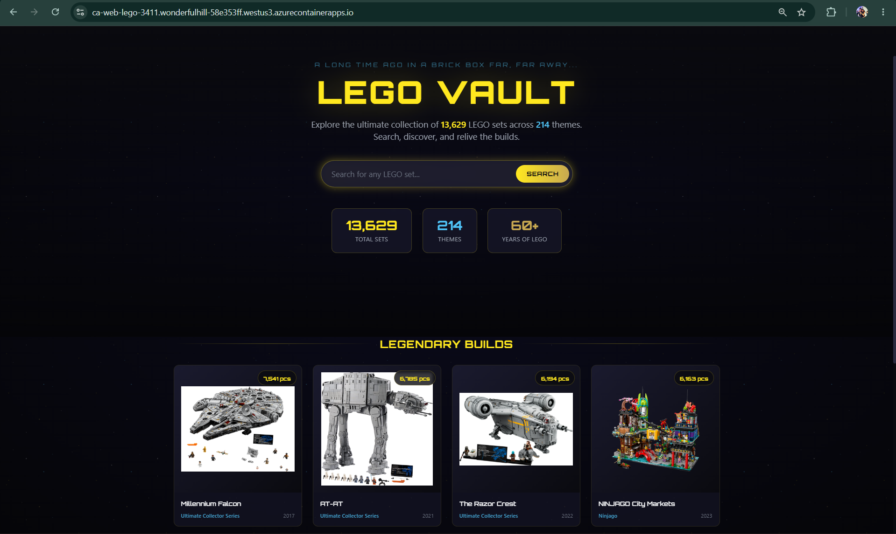
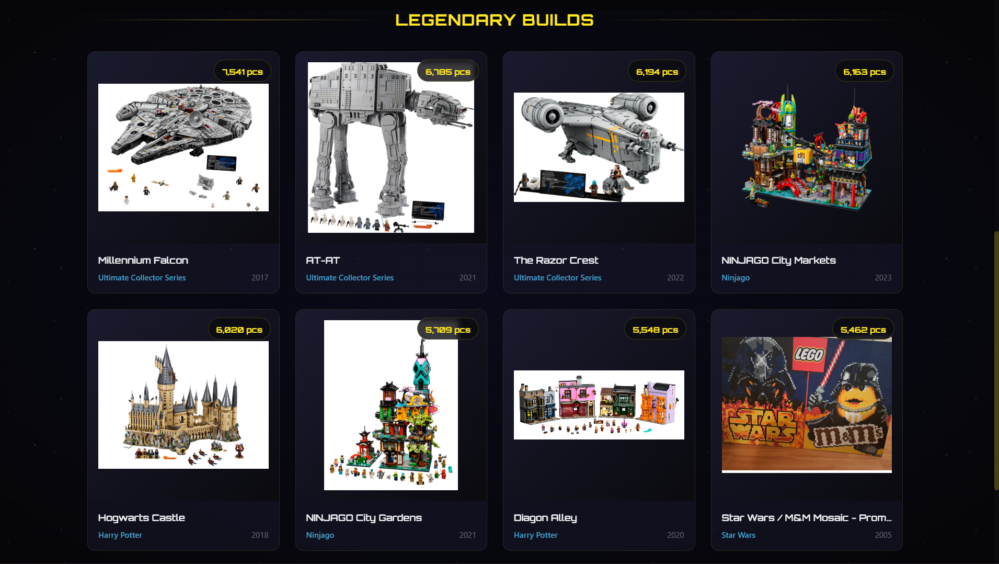
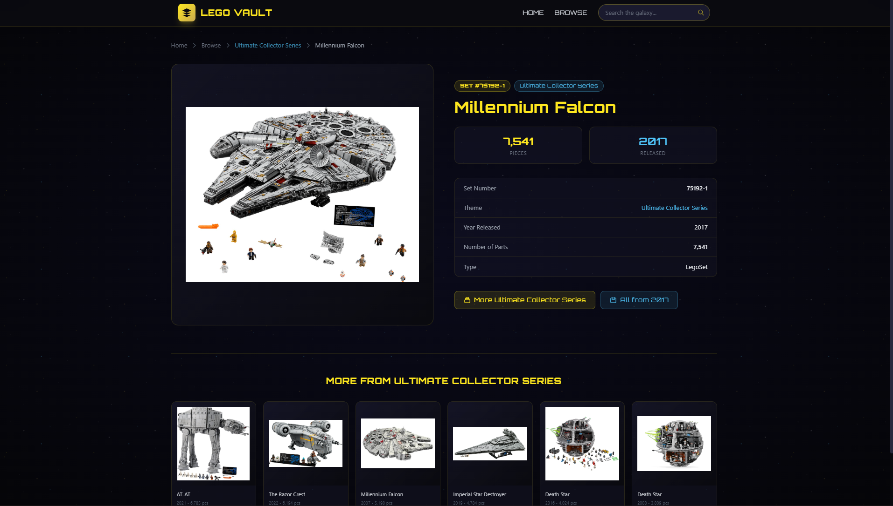

# LEGO Set Browser

A full-stack web app for browsing, searching, and filtering LEGO sets. Deployed to Azure using AI-assisted infrastructure scaffolding.



---

## Architecture

```
┌──────────────────────────────────────────────────────┐
│                Azure Container Apps                   │
│        Flask web app (Python 3.13, Gunicorn)          │
│      System-assigned managed identity (Reader)        │
└─────────────────────┬────────────────────────────────┘
                      │
                      ▼
┌──────────────────────────────────────────────────────┐
│                 Azure Cosmos DB                       │
│          Database: LegoDatabase                       │
│          Container: legoSets                          │
└─────────────────────▲────────────────────────────────┘
                      │
┌─────────────────────┴────────────────────────────────┐
│        Azure Function App (Flex Consumption)          │
│      HTTP POST — batch upsert endpoint                │
│      User-assigned managed identity (Contributor)     │
└──────────────────────────────────────────────────────┘
```

**Stack:**
- **Frontend/Backend:** Python Flask, Jinja2 templates
- **Database:** Azure Cosmos DB (NoSQL)
- **Hosting:** Azure Container Apps (web), Azure Functions Flex Consumption (ingest)
- **Auth:** Passwordless via `DefaultAzureCredential` + managed identity RBAC (no connection strings)
- **Containerization:** Docker (Python 3.13-slim, Gunicorn)
- **IaC / Deployment:** Azure CLI, Azure Developer CLI (`azd`), Bicep — scaffolded with GitHub Copilot CLI

---

## Features

- Browse thousands of LEGO sets with pagination
- Filter by theme, year, and part count
- Full-text search across set names
- Detail view with related sets from the same theme
- Featured sets homepage (sets with 2000+ pieces)
- Image proxy for CDN-hosted set images
- Serverless ingest endpoint for bulk-upserting sets via HTTP POST

| Browse Sets | Set Detail |
|---|---|
|  |  |

---

## Project Structure

```
lego-set-browser/
├── app.py                        # Flask app — browse, search, detail routes
├── requirements.txt              # Flask, azure-cosmos, azure-identity, gunicorn
├── Dockerfile                    # Python 3.13-slim, Gunicorn on port 8000
├── .env.sample                   # Environment variable template
├── templates/                    # Jinja2 HTML templates
│   ├── base.html
│   ├── home.html
│   ├── browse.html
│   ├── detail.html
│   └── 404.html
├── static/css/style.css          # Styles
└── azure-function/               # Serverless ingest pipeline
    ├── requirements.txt
    ├── host.json
    └── BatchUpsert/
        ├── function.json         # HTTP POST trigger binding
        └── __init__.py           # Batch upsert logic → Cosmos DB
```

---

## Key Technical Decisions

**Managed identity over connection strings**
The app uses `DefaultAzureCredential` (via `azure-identity`) for all Cosmos DB access — no keys or secrets stored anywhere. The Container App has a system-assigned managed identity with the *Cosmos DB Built-in Data Reader* role; the Function App uses a user-assigned managed identity with *Cosmos DB Built-in Data Contributor*.

**Flex Consumption (FC1) for the Function App**
The ingest endpoint uses Azure Functions Flex Consumption — scales to zero when idle, scales out per-request. Better cost profile than a dedicated App Service plan for an infrequently-called ingest endpoint.

**Containerized Flask on Container Apps**
The web app is packaged as a Docker image and hosted on Azure Container Apps — fully managed, serverless container hosting with built-in HTTPS and autoscaling.

---

## Ingest API

The Function App exposes a single endpoint for batch-upserting LEGO sets:

```
POST /api/BatchUpsert
Content-Type: application/json

[
  {
    "set_number": "75192",
    "name": "Millennium Falcon",
    "theme_name": "Star Wars",
    "year_released": 2017,
    "number_of_parts": 7541,
    "type": "Normal",
    "image_url": "https://cdn.rebrickable.com/..."
  }
]
```

Response:
```json
{ "upserted": 1 }
```

`set_number` is mapped to Cosmos DB's `id` field automatically.

---

## Local Development

```bash
# 1. Install dependencies
pip install -r requirements.txt

# 2. Copy the environment sample and fill in your Cosmos DB endpoint
cp .env.sample .env

# 3. Run locally
python app.py
```

App available at `http://localhost:5000`.

## Running with Docker

```bash
docker build -t lego-set-browser .
docker run -p 8000:8000 lego-set-browser
```

---

## Environment Variables

| Variable | Description | Default |
|---|---|---|
| `COSMOS_ENDPOINT` | Cosmos DB account endpoint | *(required)* |
| `COSMOS_DATABASE` | Database name | `LegoDatabase` |
| `COSMOS_CONTAINER` | Container name | `legoSets` |
| `AZURE_CLIENT_ID` | Managed Identity client ID (optional) | — |

---

## AI Skills Used

This project was deployed using a **three-skill chain** in GitHub Copilot CLI:

| Skill | What it did |
|---|---|
| `azure-prepare` | Scanned the workspace, classified the Flask app, scaffolded Bicep IaC, generated Azure Function code from a natural language description, and created `azure.yaml` for `azd` |
| `azure-validate` | Compiled Bicep, verified Docker was running, checked Python runtime version and FC1 availability in the target region, confirmed subscription access |
| `azure-deploy` | Ran `azd up`, provisioned ACR + Container Apps Environment + Function App + Storage, built and pushed the Docker image, zip-deployed the function code, and wired environment variables |

The Azure Skills plugin for GitHub Copilot CLI turns a single natural-language prompt into a full infrastructure provisioning and deployment pipeline — no portal, no manual ARM templates.
---

## Project Context
Built as part of Microsoft Build 2026 Lab (LAB501: *From Zero to Deployed on Azure with AI Agents*).

---

## What I Learned

**Deployment & Infrastructure**
- Deploying containerized Python apps to Azure Container Apps using `azd` and Bicep
- Writing and deploying Azure Functions with HTTP triggers and Cosmos DB bindings
- Using GitHub Copilot CLI's `azure-prepare → azure-validate → azure-deploy` skill chain to scaffold and ship infrastructure from a single natural-language prompt

**Security & Identity**
- Configuring passwordless Azure auth with managed identity and Cosmos DB native RBAC (no connection strings or secrets)
- The difference between ARM-level roles (e.g. `Cosmos DB Account Reader Role`) and Cosmos DB data-plane roles (e.g. `Cosmos DB Built-in Data Reader`) — and why the wrong one causes a `Forbidden` error even with a role assigned
- Auditing AI-generated infrastructure for production security gaps

**Debugging & Troubleshooting**
- Diagnosing a `CosmosHttpResponseError: Forbidden (Sub Status: 5301)` error by streaming container logs with `az containerapp logs show --follow`
- Identifying that `az containerapp update --set-env-vars` was silently failing to persist values by inspecting the JSON response template
- Fixing environment variable injection through the Azure Portal when CLI commands produced unexpected results
- Understanding why RBAC role assignment propagation delay causes 500 errors even after a role is successfully created
